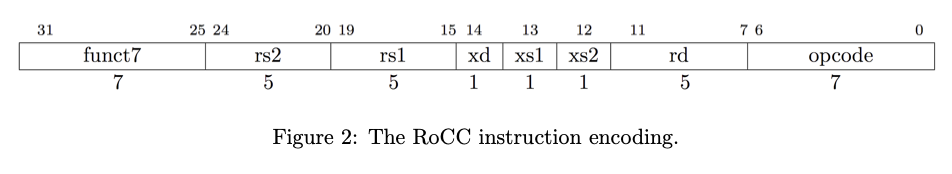

# Composer-Software

This repository contains the necessary software to interact with a Composer design over the AWS F1 FPGA Framework.

### Dependencies
To my understanding, this should be pretty cross-platform and work with most UNIX systems.

For AWS backend support, you will need the [AWS FPGA SDK](https://github.com/aws/aws-fpga) installed.
This is not necessary for simulation support and the library will simply skip over any AWS specific code when building if we can't detect it.
CMake will warn you if it can't find the SDK.

[//]: # ([Amazon F1 SDK]&#40;https://github.com/aws/aws-fpga&#41; - this is a dependency from the)

[//]: # ([Composer Hardware]&#40;https://github.com/ChrisKjellqvist/Composer-Hardware&#41; repository. Under normal circumstances, the)

[//]: # (Composer-Hardware directory will contain the SDK, which can be used instead of installation in another directory. For)

[//]: # (everything here to work properly, `SDK_DIR` needs to be defined, which is typically set when running `sdk_setup.sh` from)

[//]: # (the SDK directory. Do **not** set this manually.)

[//]: # (If you are)

### Installation

```cmake -B build -S . && cd build && sudo make install```

This requires root permissions. For user-mode builds make sure to pass the `-DCMAKE_INSTALL_PREFIX=<dir>` to cmake.
After which, make sure that this path is accessible to the linker and cmake. Then, of course, there's no
reason to use `sudo`.

I haven't tried using the non-root version but with enough effort gettingn CMake to find your tool, it should work.
It's also pretty simple to remove the includes and dynamic library from the root install folders if you don't feel like
polluting them.

### Using in your project

The project is currently set up to support CMake-based projects. I suppose you could use Makefile or whatever, but you'll
just have to make sure to help your compiler find the include path and use the `-lcomposer` flag during link time.

```cmake
# your CMake project
#...
find_package(composer REQUIRED)
target_link_libraries(<your_target> PUBLIC APEX::composer)
#...
```

That's all it should take and you'll have access to the `rocc.h`, `fpga_handle.h`, `fpga_transfer`, and `composer_util.h`
headers.
d
# Interface Basics

The composer software library uses 3 main types to communicate with an accelerator:

- `rocc_cmd` - RoCC command to be delivered to the accelerator
- `rocc_response` - Response from the accelerator corresponding to a `rocc_cmd`
- `fpga_handle_t` - FPGA interface object

## `fpga_handle_t`

```c
#include <fpga_handle.h>
```
This is an interface for the FPGA with two specializations: `fpga_handle_sim_t` and `fpga_handle_real_t`.
`fpga_handle_sim_t` correponds to a VSIM/Verilator simulation of the composer and `fpga_handle_real_t` corresponds to a an actual
FPGA running on an Amazon F1 instance.
They both share the following interface.


### `send(const rocc_cmd &cmd)`

Send a RoCC command to the accelerator. If the build is a debug build, it will print the contents of the command.

```c++
#include <rocc.h>
#include <fpga_handle.h>
...
fpga_handle_real_t my_handle;
auto my_flush_cmd = rocc::flush_cmd();
my_handle.send(my_flush_cmd);
```

### `rocc_response get_response()`

Wait for a response from the accelerator. Returns a `rocc_response` type.

```c++
fpga_handle_real_t my_handle;
auto my_cmd = rocc::start_cmd(...);
my_handle.send(my_cmd);

auto resp = my_handle.get_response();
int retval = resp.data;
int dest_reg = resp.rd;
```

### `flush()`

Wait for all in-flight instructions to be flushed from the accelerator.

```c++
fpga_handle_real_t my_handle;
my_handle.flush()
```

## RoCC Composer Instructions: `rocc_cmd`

The RoCC Instruction format is shown below.
[Credit](https://inst.eecs.berkeley.edu/~cs250/fa13/handouts/lab3-sumaccel.pdf) to Ben Keller for this figure.



Commands for the composer use this format for the instruction base and sends an additional 2 64-bit payloads. The 7
function bits are slightly mis-used in Composer. The top 4 bits are the system_id corresponding to which type of
composer core is being used. The actual function that you want the composer core to perform is the bottom 3 bits.

Currently, the composer supports 3 different functions that use a different combination of opcode and function bits.
To ensure that these bits are set correctly, the end-user is unable to set these bits directly and the exposed interface
sets these according to the function called. The functions are `rocc::flush_cmd()`, `rocc::start_cmd(...)`, and
`rocc::addr_cmd(...)`.

### `rocc::flush_cmd()`

The flush command takes no user arguments and waits for all in-flight instructions to complete executing before the
flush command returns.

### `rocc::start_cmd()`

```c++
rocc_cmd start_cmd(uint16_t system_id, // 4 bits
                   uint8_t rs1_num, // 5 bits
                   uint8_t rs2_num, // 5 bits
                   bool expect_response, // 1b
                   RD rd, // 5 bits
                   uint8_t xs1, // 1b
                   uint8_t xs2, // 1b
                   uint8_t core_id, // 8b
                   uint64_t rs1, // 64 bits
                   uint64_t rs2); // 64 bits
```

The `start_cmd` interface allows a user to begin a kernel execution inside a functional unit. The only fields here
that have a special purpose on the Composer system are `system_id`, `core_id`, and `rd`. `system_id` obviously
determines what group of cores that a command is routed to. `core_id` as well determines which core the command is
routed to within the system. Composer also has a few "special-purpose" registers that can be accessed by properly
setting the `rd` field.

Before we deep-dive into `rd`, a quick node on the `expect_response` field. 
The field corresponds to `xd` in the instruction reference and is set to high if you are expecting a response from the command. 
Otherwise, no reponse will be sent back over the AXIL interface. 
If you specify `expect_response=0` and wait for a response, you'll stall and never return. 
**Note to self**: this really shouldn't happen. Waiting for a command to return that was specified to not return should throw an exception (or have a timout).

Notice that the destination register is type `RD`. To emphasize the use of special-purpose Composer registers, we
use `enum RD`. There are 32 registers, but register 16 through 22 (inclusive) are special purpose registers for
accumulating AXI-4 memory bus statistics. If a non-special register is provided for `rd`, then the return value as part
of `rocc_response` will be the value returned from the Composer core during execution. If `rd` is a special register,
then the value stored within the special composer register will be returned.

```c++
enum RD {
  /**
   * General purpose registers
   */
  R0 = 0,
  R1 = 1,
  R2 = 2,
  R3 = 3,
  R4 = 4,
  R5 = 5,
  R6 = 6,
  R7 = 7,
  R8 = 8,
  R9 = 9,
  R10 = 10,
  R11 = 11,
  R12 = 12,
  R13 = 13,
  R14 = 14,
  R15 = 15,
  /**
   * Special Registers
   **/
  AddressReadCnt = 16,
  AddressWriteCnt = 17,
  ReadCnt = 18,
  WriteCnt = 19,
  WriteResponseCnt = 20,
  ReadWait = 21,
  WriteWait = 22,
  /**
   * More general purpose registers
   */
  R23,
  R24,
  R25,
  R26,
  R27,
  R28,
  R29,
  R30,
  R31
};
```

The [AXI Spec](https://developer.arm.com/documentation/102202/0300/Channel-signals) has 5 ports for memory

- AW - Write address port
- W - Write data port
- B - Write response port
- AR - Read address port
- R - Read response port

Composer counts the number of responses for each one of these ports for debugging purposes (presumably). Composer also
collects the number of cycles spent waiting for read responses(21) and for write responses(22)

### `addr_cmd(...)`

The composer simplifies the memory interface by exposing a simpler memory interface than DDR to the programmer.
Currently, the only memory interface supported naturally in the Composer interface is contiguous accesses. 
Code exists to support sparse (random) reads/writes but it is not properly integrated into the Composer
interface yet.

To use the contiguous read interface, the cpu provides a starting address for each channel, and then the hardware module
can signal that it is ready for the next 512b starting from that address, simultaneously incrementing the address
for the next access. To provide the starting address, we provide the following command
interface.

```c++
  static rocc_cmd addr_cmd(uint16_t system_id,
                           uint8_t core_id,
                           uint8_t channel_id,
                           uint64_t addr);
```

### std::ostream &operator<<

You can print out `rocc_cmd`s using the `<<` operator:

```c++
auto my_flush = rocc_cmd::flush();
std::cout << "My flush command is composed like so: " << my_flush << std::endl;
```

## RoCC Response

```c++
struct rocc_response {
  uint32_t data;
  uint8_t core_id;
  uint8_t system_id;
  uint8_t rd;
};
```

Whenever a instruction successfully completes, the accelerator responds with a `rocc_response`. It contains a 56-bit
return value, the id of the composer system that performed the instruction, the id of the core within the system that
completed it, and the destination register that came from the instruction.

**Note to self**: the length of the return value should be improved/clarified in the future...

# Running your code

Once you have your code written using this library, assuming you're using CMake, you can simply run
```shell
mkdir build && cd build
cmake .. && make
./<your_program>
```
Make sure to run this code AFTER the composer system has booted up.
Otherwise, the file descriptors that the library will be looking for will not be set up and you'll crash!