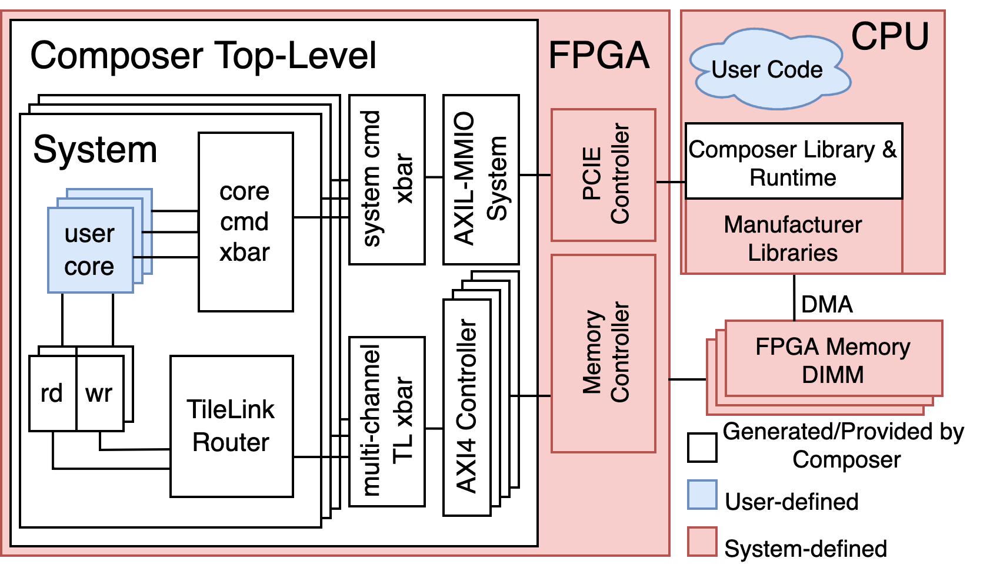

# Composer Hardware

Developing custom hardware designs is hard for several reasons - one of which being that
interacting with system interfaces correctly and efficiently is extremely challenging.
Composer provides a scaffolding for user designs that intuitively hooks them into a scalable
design and provides utilities for common memory primitives.

A guide for basic instructions on how to get something running on Composer exists in the root
directory.
In the following documentation we provide more precise descriptions, use case scenarios, etc...
for Composer tooling.

## Table of Contents

- [Composer Hardware](c_hardware.md)
  - [Composer Core](c_core.md)
  - [Memory Subsystem](c_memory.md)
    - [Readers](c_readers.md)
    - [Writers](c_writers.md)
    - [Scratchpad](c_scratchpad.md)
  - [Accelerator Configuration](c_config.md)
- [Software](c_software.md)
- [Deployment]()
  - [AWS]()
  - [Kria]()
  - [Simulation]()

[Next (Composer Hardware)](c_hardware.md)